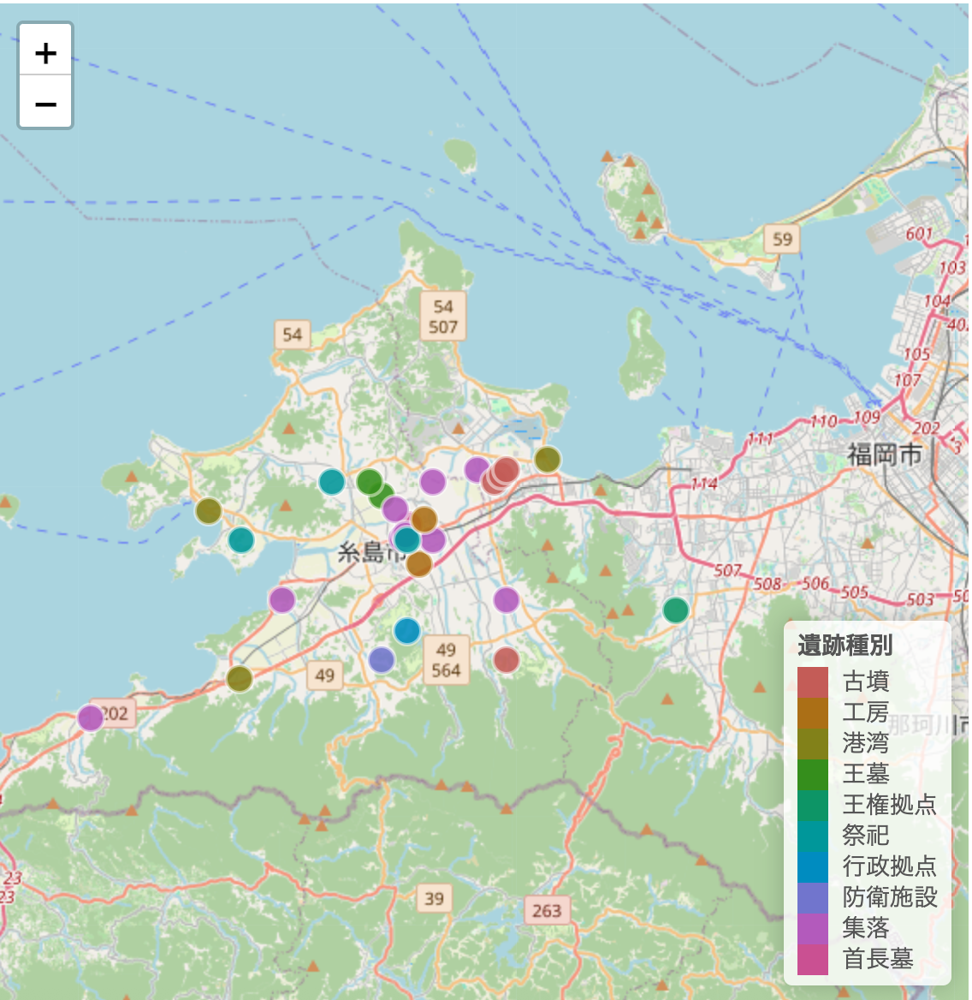

# 伊都国遺跡可視化プロジェクト (ito-museum-app2)

ITエンジニアとしての15年以上の実務経験と、歴史・考古学への深い知見を融合させ、福岡・糸島エリアの歴史的価値をデジタル技術で可視化するプロジェクトです。

## 🏛️ プロジェクトのビジョン
「埋もれたデータを、市民に開かれた生きた歴史へ」  
行政のオープンデータを活用し、誰もが直感的に遺跡の分布や種類を理解できるインタラクティブなプラットフォームの構築を目指しています。

## 📸 開発目標と現在のステータス
現在、Web公開版（Hugging Face）ではインフラ環境の制約によりデフォルト表示となっていますが、ソースコード上では遺跡種別ごとの詳細な色分けロジックを実装済みです。

### 本来の設計（ローカル環境での動作）

*※遺跡の種別（王墓、首長墓、集落等）に応じた色分けと、時代別フィルタリングを実装しています。*

## 🚀 公開URL
- **Web App:** [ito-museum-app2 on Hugging Face](https://huggingface.co/spaces/yuda0629/ito-museum-app2)
  - ※現在、クラウド環境への最適化（デバッグ）を継続中です。最新のロジックは本リポジトリの `app.R` を参照してください。

## 機能
遺跡の種類（王墓・首長墓・集落など）ごとにカラーピンで地図表示
キーワード検索（遺跡名・種類・時代・説明）
時代フィルター（弥生・古墳・奈良など）
遺跡詳細パネル（種類・時代・説明・座標）

## 動作要件
	バージョン
Python	3.9 以上
R	4.0 以上
pip / CRAN パッケージ	requirements.txt / install.packages() 参照

## 📂 ディレクトリ構成
本プロジェクトは、Web公開用の軽量版（Python）と、詳細解析用のオリジナル版（R）のハイブリッド構成となっています。

```text
.
├── ito-museum-app2/       # Web公開用パッケージ（Hugging Face Spaces）
│   ├── app_streamlit.py   # Streamlitによるインタラクティブマップ実装
│   ├── app.py             # 依存関係を最小化したスタンドアロン版
│   ├── ito_sites_clean.csv # クレンジング済みの遺跡位置情報データ
│   └── requirements.txt   # Python環境定義
├── app.R                  # 【メイン】R/Shinyによる高度な可視化・分析ロジック
├── CONTRIBUTING.md        # 開発参加・データ提供に関するガイドライン
└── README.md              # 本ドキュメント

## ローカル起動
# Python 版
cd ito-museum-app2
python3 -m venv .venv
source .venv/bin/activate        # Windows: .venv\Scripts\activate
pip install -r requirements.txt
streamlit run app_streamlit.py
ブラウザで http://localhost:8501 が自動的に開きます。

# R 版
install.packages(c("shiny", "leaflet", "dplyr"))
shiny::runApp("app.R")

## 技術スタック
技術
Python	Streamlit / Folium / pandas
R	Shiny / leaflet
地図タイル	OpenStreetMap
🛠️ Technical Details & Challenges

## Data Pipeline: 
行政のオープンデータ（CSV/JSON）を R の tidyverse パッケージでクレンジングし、空間情報（緯度経度）を Leaflet で扱える形式に最適化しています。

## UI/UX: 
考古学に馴染みがない層でも直感的に操作できるよう、サイドバーによる時代別（縄文・弥生・古墳など）の動的フィルタリングを実装しました。

## Performance: 
多数のプロットによる描画負荷を軽減するため、Marker Cluster の採用を検討するなど、実務レベルのパフォーマンス最適化を意識しています。

## 開発参加
変更は Pull Request とレビューを前提にしています。詳細は CONTRIBUTING.md を参照してください。
バグ報告・機能提案は Issues からお気軽にどうぞ。

## ⚖️ ライセンス & オープンデータ
License: MIT License
Data Source: 本アプリは福岡県オープンデータサイトおよび糸島市オープンデータの情報を元に作成されています。データの正確性については細心の注意を払っていますが、学術的な厳密さについては今後の専門教育を通じてブラッシュアップしていく予定です。
